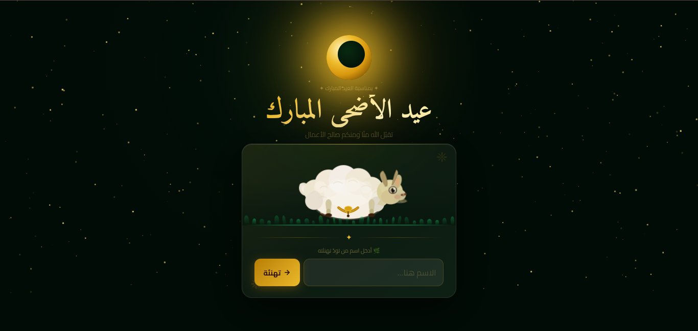

# 🎉 Eid Mubarak Greeting Website

A responsive, elegant, and interactive web-based greeting card built to celebrate Eid. This project provides a smooth user experience with clean animations and is fully optimized for all device screens (Mobile, Tablet, and Desktop).

🚀 Live Demo: [Click here to view the website](https://eid-mobark7.netlify.app/)

---



---


## ✨ Features
* 📱 Fully Responsive Design: Adapts perfectly to any screen size.
* 🎨 Clean Architecture: Organized with separated production-ready files (`HTML`, CSS, and `JS`).
* ⚡ Fast & Lightweight: Deployed smoothly using Netlify with zero lag.
* 📝 Well-Commented Code: Easy to read, understand, and maintain.

---

## 🛠️ Built With
* HTML5 - Structured the semantic content.
* CSS3 - Styled the visual components and layouts.
* JavaScript - Added dynamic interactivity and logic.
* Netlify - Hosting and continuous deployment.

---

## 📂 Project Structure
```text
├── index.html       # The main entry point and structure of the website
├── style.css        # Clean, modular CSS styles for the presentation
└── script.js        # JavaScript file for dynamic interactions and logic
